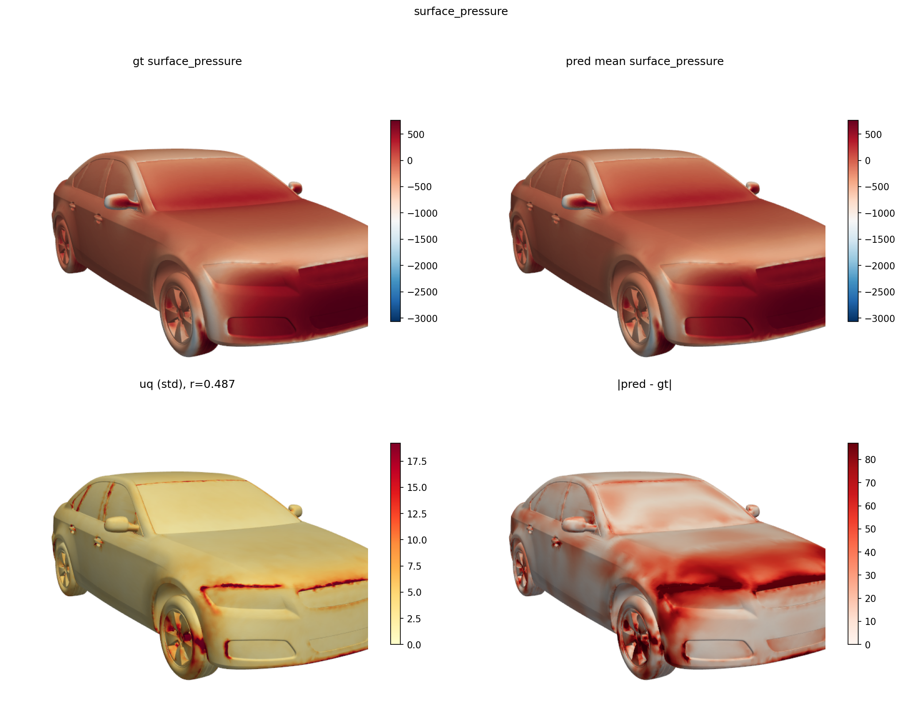
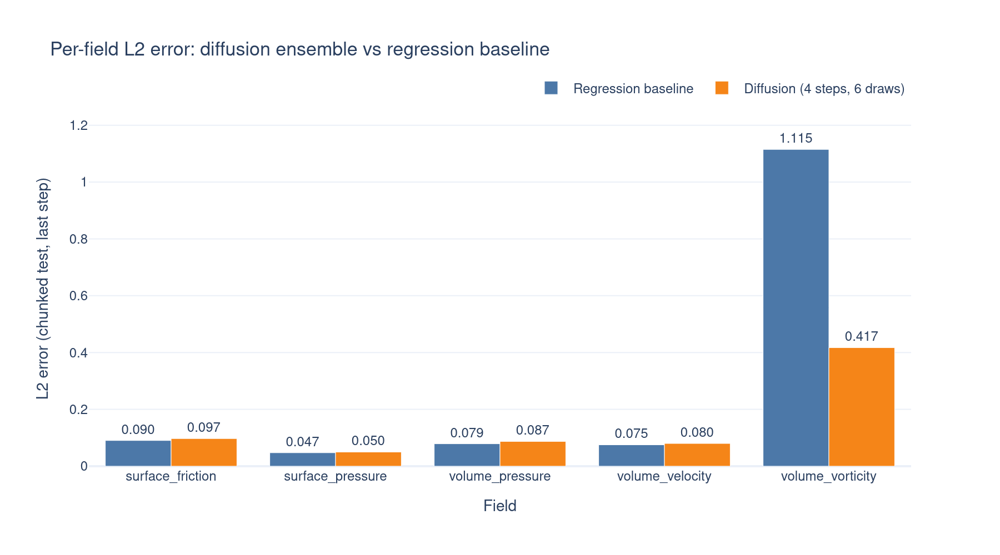
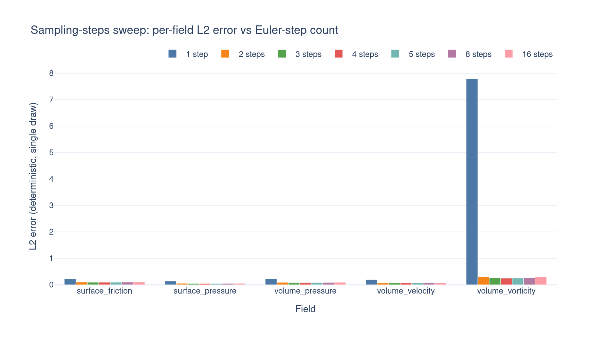
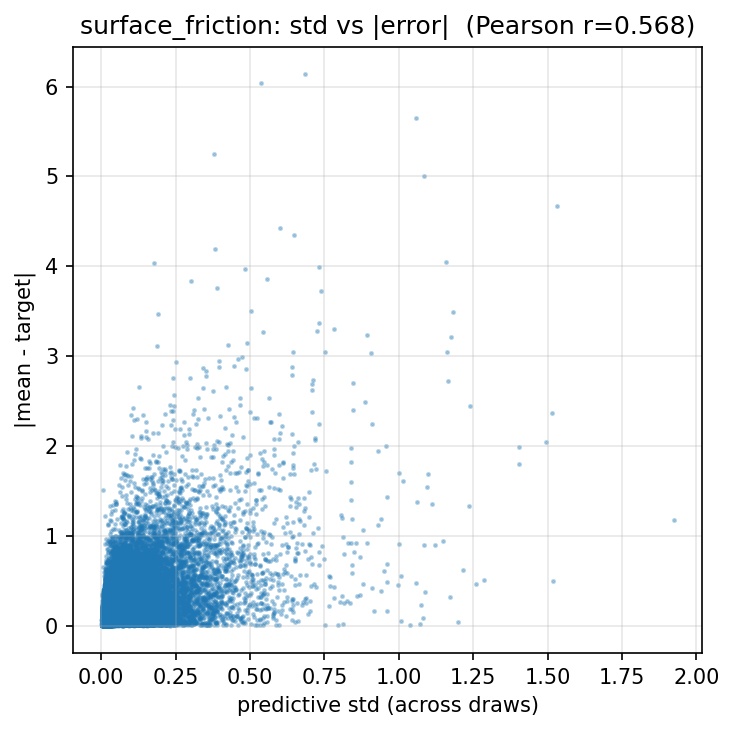

# Diffusion UQ on DrivAerML




Generative uncertainty quantification for steady CFD fields on top of the
[AB-UPT](https://arxiv.org/abs/2502.09587) backbone via **data-space
diffusion** — denoise surface + volume fields directly at anchor positions,
with one backbone forward per Euler step. An ensemble of draws yields
per-point std, calibration of integrated quantities (Cd, Cl).

The recipe is a `uv`-managed package (`pyproject.toml`) that pulls
`emmiai-noether` and `aero-cfd-recipe` as editable path deps, so it picks up
the surrounding repo's `src/` and the sibling `aero_cfd` recipe automatically.

## Method

We train a [flow matching](https://arxiv.org/abs/2210.02747) model in the
data space of field values. Concretely:

- **Objective.** FM Velocity prediction along the straight-line
  [rectified-flow](https://arxiv.org/abs/2209.03003) interpolant between
  Gaussian noise and the clean target. One Euler step = one AB-UPT forward.
- **Conditioning.** Geometry comes in via the standard AB-UPT supernode +
  anchor pipeline; the diffusion time `t ∈ [0, 1]` enters via DiT-style
  ([Peebles & Xie, 2022](https://arxiv.org/abs/2212.09748)) adaptive layer
  norm on every transformer block. Noisy field values are concatenated to the
  anchor inputs.
- **Optional minibatch-OT pairing.** `--minibatch-ot` pairs noise / target
  samples within a batch by optimal transport ([Tong et al.,
  2023](https://arxiv.org/abs/2302.00482)) for straighter, lower-variance
  trajectories.
- **UQ.** A trained model is sampled `N` times per geometry from independent
  noise seeds; the per-point sample std is the uncertainty estimate, and the
  ensemble mean is the point prediction.

## Training

### Data-space diffusion (flow matching)

```bash
uv run python -m scripts.train_dataspace_diffusion \
    --dataset-root $DATASET \
    --output-path ./outputs/abupt_diffusion \
    --paradigm flow_matching \
    --max-epochs 500 --batch-size 1 --lr 5e-5 \
    --ema-decays 0.9999
```

Defaults match the reported run: 9.1M params, hidden 192, 3 heads, 16K
supernodes, 65K geometry points, 16K surface + 16K volume anchors. Pass
`--minibatch-ot` to enable OT pairing.

### Regression baseline

`--paradigm regression` swaps in `AeroABUPT` + `WeightedLossTrainer` for a
deterministic baseline at matched backbone, geometry budget, and optimizer
schedule. `run_abupt_regression.sbatch`.

## SLURM

| File | Stage |
|---|---|
| `run_abupt_diffusion.sbatch` | data-space diffusion (full hyperparams baked in) |
| `run_abupt_regression.sbatch` | deterministic AeroABUPT baseline |

Both launchers prepend `$SLURM_JOB_ID` to `config.run_id` so wandb and
output dirs trace back to the job.

## Evaluation

Single-GPU eval scripts that load a trained checkpoint and dispatch
in-process via `noether.inference.evaluate`:

| Script | What it does |
|---|---|
| `scripts/eval_sampling_steps_sweep.py` | Side-by-side metrics for multiple Euler-step counts (`--steps 1 2 4 8 16`) in one pass; emits per-step `steps_{n}/` prefixes to wandb. |
| `scripts/eval_uq.py` | Draws `--n-uq-samples` per geometry; reports per-point std-vs-\|error\| Pearson correlation and Cd / Cl mean / std / empirical-CI calibration. |
| `scripts/report.py` | Builds the tables and Plotly bar charts shown below from `summary.yaml` artifacts. |

Example:

```bash
uv run python -m scripts.eval_uq \
    --run-dir outputs/abupt_diffusion/30035_2026-05-11_spk1e \
    --n-uq-samples 10 --sampling-steps 10 \
    --resume-checkpoint best_model.loss.test.total
```

At eval time `eval_uq` re-enables `surface_normals`, `surface_area`, and
`use_surface_position_as_input` (training omits them) so Cd / Cl integration
finds its inputs.

## Report

Final test-set L2 errors for the data-space diffusion model (10 Euler sampling steps) versus the deterministic regression
baseline. The two runs share the same AB-UPT backbone, geometry budget, and
optimizer schedule, so wall-clock training cost and parameter count are
roughly matched — the diffusion model just adds the per-anchor noise input
and DiT-style time conditioning on top.

> [!NOTE]
> **Caveat.** The learning rate was *not* swept for these experiments; it
> was reused as-is from the regression configuration (`5e-5`). Flow-matching
> objectives have a different loss landscape than direct regression and
> typically tolerate (and benefit from) larger LRs and longer schedules. The
> numbers below should therefore be read as a *lower bound* on what the FM
> model can achieve — a tuned LR and a longer training budget would very
> likely close, and on the smooth fields possibly reverse, the gap to the
> regression baseline.

| Field | Regression baseline | Diffusion (10 steps) | Δ (diff − base) | Relative |
|---|---:|---:|---:|---:|
| `surface_friction` | 0.0905 | 0.0973 | +0.0069 | +7.6% |
| `surface_pressure` | 0.0473 | 0.0498 | +0.0025 | +5.4% |
| `volume_pressure` | 0.0790 | 0.0872 | +0.0082 | +10.4% |
| `volume_velocity` | 0.0753 | 0.0800 | +0.0047 | +6.3% |
| `volume_vorticity` | 1.1150 | 0.4173 | -0.6977 | -62.6% |


The evaluation was on the whole-mesh of the test split of our subsampled DrivAerML testset using only anchors for inference.
The difference between baseline and flow-matching models on all primary metrics is marginal.
The exception is volume_vorticity, where the diffusion does significantly better. This can mostly attributed to non-ideal hyperparamters of the baseline and high variance of this property.


### Sampling-steps sweep

Single-draw deterministic L2 errors (`loss/test/<field>_l2err/last`) read
from the `eval_steps<N>/` siblings of the diffusion run — i.e. the same
checkpoint sampled with different Euler-step counts. Useful for picking the
cheapest step count that still hits the accuracy floor.

| Field | 1 step | 2 steps | 3 steps | 4 steps | 5 steps | 8 steps | 16 steps |
|---|---:|---:|---:|---:|---:|---:|---:|
| `surface_friction` | 0.2183 | 0.0963 | 0.0932 | 0.0932 | 0.0938 | 0.0962 | 0.1001 |
| `surface_pressure` | 0.1387 | 0.0522 | 0.0492 | 0.0487 | 0.0488 | 0.0497 | 0.0514 |
| `volume_pressure`  | 0.2263 | 0.0893 | 0.0854 | 0.0853 | 0.0858 | 0.0879 | 0.0912 |
| `volume_velocity`  | 0.1957 | 0.0769 | 0.0752 | 0.0757 | 0.0766 | 0.0792 | 0.0832 |
| `volume_vorticity` | 7.7955 | 0.3061 | 0.2545 | 0.2466 | 0.2485 | 0.2659 | 0.3050 |



One Euler step is far off (the flow can't resolve `volume_vorticity` at all),
but two steps already collapse the error to near-optimal. The minimum sits
at 3–4 steps for every field; beyond that, accuracy drifts back up slightly
— the rectified-flow trajectory is approximated more finely, but per-step
error accumulates faster than the discretization gain. Rectified flow's
straight-line interpolant is the reason 2 steps already get close: under a
perfectly straight trajectory, one Euler step would be exact.

### Uncertainty quantification

For each field, we draw 6 samples per geometry (4 Euler steps) and compute
the per-point standard deviation across draws. The metric below is the
Pearson correlation between that per-point std and the per-point absolute
error against ground truth on the test set
(`loss/chunked_test/<field>_uq_corr/last`). A high value means the model's
own spread is a reliable proxy for *where* it's wrong — i.e. the uncertainty
is calibrated in shape, even if not in scale.

| Field | Pearson r(std, \|error\|) |
|---|---:|
| `surface_friction` | 0.579 |
| `surface_pressure` | 0.369 |
| `volume_pressure`  | 0.559 |
| `volume_velocity`  | 0.445 |
| `volume_vorticity` | 0.501 |



All correlations are positive — the ensemble std flags the right regions in
every field — but they sit in the 0.37–0.58 range, so the signal is
informative rather than precise. `surface_friction` and `volume_pressure`
calibrate best; `surface_pressure` is the weakest, consistent with it also
being the field where the ensemble mean lags the regression baseline most
(+65.5%). The Cd / Cl coverage numbers in the same summary show the
complementary scale problem: the integrated-coefficient std is too tight
(empirical 1-σ coverage is 0, mean |z| ≈ 8–10), so the per-point shape is
useful for triage but the scale would need recalibration (e.g. temperature
scaling on the std, or a held-out calibration set) before being used for
hard confidence intervals.

## Project structure

```
diffusion_uq/
├── pyproject.toml                       # uv package: noether + aero_cfd as editable deps
├── experiments.py                       # build_abupt_config — single factory for regression + diffusion
├── models/diffusion_abupt.py            # DiffusionABUPT (data-space, DiT-style time modulation)
├── trainer/diffusion_ab_upt_trainer.py  # DiffusionABUPTTrainer + schedule_config
├── callbacks/
│   ├── dataspace_diffusion_chunked_eval.py   # periodic + full-mesh chunked eval
│   └── dataspace_diffusion_uq.py             # ensemble UQ (std-vs-error, Cd/Cl calibration)
├── scripts/
│   ├── train_dataspace_diffusion.py
│   ├── eval_sampling_steps_sweep.py
│   ├── eval_uq.py
│   └── report.py                        # comparison + step-sweep + UQ tables & Plotly bars
├── run_abupt_diffusion.sbatch
├── run_abupt_regression.sbatch
└── viz.py
```

## References

- AB-UPT — Alkin et al., 2025 — <https://arxiv.org/abs/2502.09587>
- DrivAerML benchmark — Ashton et al., 2024 — <https://arxiv.org/abs/2408.11969>
- Flow Matching for Generative Modeling — Lipman et al., 2022 — <https://arxiv.org/abs/2210.02747>
- Rectified Flow — Liu et al., 2022 — <https://arxiv.org/abs/2209.03003>
- DiT (Scalable Diffusion Models with Transformers) — Peebles & Xie, 2022 — <https://arxiv.org/abs/2212.09748>
- Minibatch OT for Flow Matching — Tong et al., 2023 — <https://arxiv.org/abs/2302.00482>
