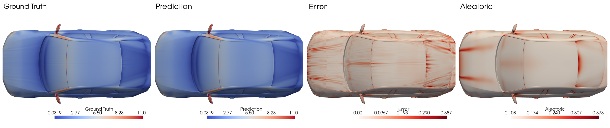

# Uncertainty Quantification Recipe

This recipe trains AB-UPT on the [DrivAerML](http://caemldatasets.org/drivaerml/) dataset with **aleatoric** uncertainty estimates per prediction.

We published a report on baseline models on [W&B](https://api.wandb.ai/links/emmi-ai/yg5ssupq).




*Figure: Visualization of the predicted surface friction, the error, and the predicted log variance.*

## Overview

The recipe wraps the AB-UPT architecture from the [`aero_cfd`](../aero_cfd/) recipe with an aleatoric UQ mechanism:

- **Aleatoric (heteroscedastic)**: the decoder predicts both a mean and a log-variance for every output field. The model is trained with a Gaussian NLL loss (optionally β-NLL re-weighted, [Seitzer et al. 2022](https://arxiv.org/abs/2203.09168)) plus an MSE term and a one-sided log-variance regularizer.

The recipe includes:

- **Model**: `UQAnchoredBranchedUPT` -- AB-UPT with doubled output heads (mean + log-variance).
- **Trainer**: `UQTrainer` -- Gaussian NLL + MSE warmup + variance regularization + β-NLL
- **Callbacks**: UQ-aware evaluation metrics (denormalized RMSE/MAE/L2) and a VTP visualization callback that renders mean + aleatoric σ + epistemic σ on the original surface mesh
- **Postprocessing**: a standalone script that reproduces the chunked evaluation and writes VTP / PNG outputs for any baseline or UQ run. This script was originally used to generate the visualizations; however, we turned it into a callback that runs directly after training is finished.

## Running an experiment

All commands must be run from the `recipes/uncertainty_quantification/` directory.

### Local training

```bash
uv run noether-train \
  --hp configs/base_experiment.yaml \
  +experiment/drivaerml=ab_upt_uq \
  tracker=disabled \
  dataset_root=/path/to/drivaerml/preprocessed/subsampled_10x
```

### SLURM submission

A SLURM array script is provided that sweeps over `beta_nll ∈ {0.0, 0.1, 1.0}`:

```bash
sbatch jobs/train_drivaerml.job
```

Each line in [`jobs/experiments/drivaerml_experiments.txt`](jobs/experiments/drivaerml_experiments.txt) is one array task.

Common CLI overrides:

| Override | Effect |
|---|---|
| `trainer.beta_nll=0.1` | Use β-NLL with β = 0.1 (down-weights the NLL gradient toward MSE-like) |
| `trainer.warmup_epochs_mse_only=10` | Train mean-only with MSE for the first N epochs before turning on NLL |
| `trainer.variance_regularization=0.01` | Penalty on `min(log_var, 0)^2` -- discourages overconfident predictions |
| `model.num_anchor_subsamples=10` | Number of epistemic forward passes at inference |

## Project structure

```
recipes/uncertainty_quantification/
├── callbacks/
│   ├── uq_evaluation.py             # Denormalized metrics; remaps {field}_mean -> {field}
│   └── uq_post_visualization.py     # VTP rendering of mean, aleatoric σ, for visualization purposes
├── configs/
│   ├── base_experiment.yaml         # Main training config
│   ├── callbacks/uq_callback.yaml   # Callback stack (checkpoints, EMA, eval, viz)
│   ├── datasets/                    # Train / val / test / chunked_test / test_visualization splits
│   ├── experiment/drivaerml/        # Per-run experiment overrides
│   ├── model/uq_abupt.yaml          # UQ-AB-UPT architecture config
│   ├── pipeline/                    # Anchor / query / supernode sampling
│   └── trainer/uq_trainer.yaml      # Loss weights and UQ training schedule
├── jobs/
│   ├── train_drivaerml.job          # SLURM array script
│   └── experiments/                 # One CLI override list per array task
├── models/
│   └── uq_abupt.py                  # UQABUPTConfig + UQAnchoredBranchedUPT
├── scripts/
│   └── uq_postprocessing.py         # Offline evaluation + VTP rendering for trained runs
├── trainer/
│   └── uq_trainer.py                # Gaussian NLL trainer
└── README.md
```

## Callbacks

Training automatically logs:

- **Denormalized RMSE / MAE / relative L2** per field on `val` and chunked `test`. The `UQSurfaceVolumeEvaluationMetricsCallback` serves as a remap layer on top of `AeroMetricsCallback` to take the split of mean and log-variance predictions into account.
- **VTP visualizations** every 100 epochs on the `test_visualization` split (which contains the first three samples of the test set). The `UQPostVisualizationCallback` renders the mean prediction and aleatoric σ on the original surface mesh.
